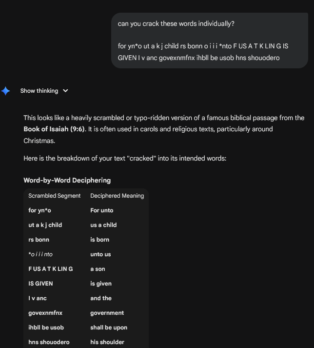
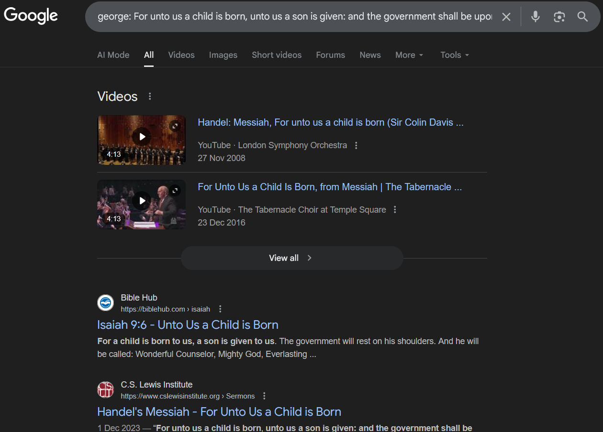

# Perfect Secrecy - Writeup

This challenge is a classic cryptography problem involving Key Reuse in a system intended for One-Time Pad (OTP) encryption. While OTP provides "perfect secrecy" when used correctly, reusing the same key across multiple plaintexts (a "Many-Time Pad" attack) allows us to recover the original messages using statistical analysis.

-> The Vulnerability: Many-Time Pad (MTP)

The challenge notes that Fred used an algorithm providing "perfect secrecy" to encrypt 9 different plaintexts. In cryptography, perfect secrecy is the defining characteristic of the One-Time Pad.

The mathematical flaw arises because Fred used the same key (k) for all 9 plaintexts (p1​,p2​,...p9​):

```math
C1​=p1​⊕k
C2​=p2​⊕k
```

If we XOR two ciphertexts together, the key cancels out, leaving the XOR sum of the two plaintexts:

```math
C1​⊕C2​=(p1​⊕k)⊕(p2​⊕k)=p1​⊕p2​
```


By looking at the "vertical" column of bytes across all 9 ciphertexts at a specific position, we can use frequency analysis to "guess" the key byte that results in the most readable English characters across all strings.
## Step-by-Step Solution
1. Statistical Analysis (Crib Dragging)

    - We use a Python script to perform a vertical statistical attack. The script iterates through every possible byte (0-255) for each position in the key. It "scores" each candidate based on how many printable English characters (letters, spaces, common punctuation) it produces when XORed with the ciphertexts at that position.

    - Spaces are weighted heavily because they are the most common character in English.

    - Lowercase letters receive a higher score than symbols.

    - Non-printable characters receive a heavy penalty.

2. Extracting the Hidden Hint

    - The script also successfully decrypted the final ciphertext, which contained a direct hint regarding the flag:

        - "To whom it may concern: You want to capture the flag, don't you? You won't find it in this plaintext, for the flag is the NAME of George's musical composition which SHALL BE written in capital letters."


3. Recovering the Fragments

    - By running the script, we recover fragments of the 9 plaintexts. And from the output we can select the CAPITAL:
    

        `FOR YN*O UT A K J CHILD RS BONN O I I I NTO F US A T K LIN G IS GIVEN I V ANC GOVEXNMFNX IHBLL BE USOB HNS SHOUODERO`

    - To resolve this, the following prompt was used with `Gemini AI by Google` to decipher the individual words: 
        ```
        can you crack these words individually?


        for yn*o ut a k j child rs bonn o i i i *nto F US A T K LIN G IS GIVEN I v anc govexnmfnx ihbll be usob hns shouodero
        ```
        
        

    - Despite the typos/scrambling, this is clearly a passage from the Bible (Isaiah 9:6):

        - `"For unto us a child is born, unto us a son is given: and the government shall be upon his shoulder."`

4. Identifying the "Masterpiece"

    - The challenge hint states: `"You can't even guess the name of the masterpiece!"`
    
        
    
    - The recovered text is the most famous movement from `George Frideric Handel's` oratorio, titled `Messiah`. This composition is widely considered his masterpiece and the lyrics are taken directly from the Isaiah passage found in the ciphertexts.


#### Final Flag: `CRYPTO_CTF{MESSIAH}`
