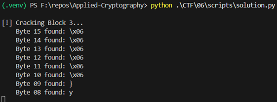
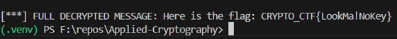

# 203 hours later... - Writeup
This challenge tasks us with decrypting a message encrypted using AES-CBC. While we don't have the encryption key, we are provided with an Oracle—a server endpoint that tells us whether a specific ciphertext, when decrypted, has valid or invalid padding. This vulnerability is known as a Padding Oracle Attack.
1. Challenge Analysis
    - The challenge provides several key pieces of information:
        - Encryption Algorithm: AES in Cipher Block Chaining (CBC) mode.

        - Ciphertext Source: GET http://141.85.224.115:7204/encrypt

        - Oracle Endpoint: POST http://141.85.224.115:7204/oracle (accepts JSON with a ciphertext key).

        - Ciphertext Structure: The first 16 bytes (32 hex characters) are the Initialization Vector (IV), followed by the encrypted blocks.

2. The Vulnerability: How it Works

    - AES-CBC requires the plaintext to be a multiple of the block size (16 bytes). To achieve this, PKCS#7 padding is used. If the message is 13 bytes, 3 bytes of 0x03 are added. If it is 15 bytes, 1 byte of 0x01 is added.

    - In CBC decryption: 

    ```math
    Pi​=Dk​(Ci​)⊕Ci−1​
    ```


    - A Padding Oracle attack works because:
        - The server decrypts our submitted ciphertext.

        - The server checks if the last bytes of the resulting plaintext follow the PKCS#7 standard.

        - The server returns a specific error (or status code) if the padding is incorrect.

    - By systematically modifying the "previous" ciphertext block (Ci−1​), we can force the "current" plaintext block (Pi​) to end in valid padding (e.g., 0x01). Because we know the value we injected and the padding value we achieved, we can mathematically derive the original plaintext without ever knowing the key.

3. Exploitation Script

    - The `solution.py` script automates this process by iterating through each block and each byte within that block.
    Key Steps in the Script:

    - Block Splitting: The ciphertext is divided into 16-byte chunks.

    - Byte Brute-forcing: For the last byte of a block, it tries all 256 possible values in the corresponding byte of the previous block until the Oracle returns "Valid Padding."

    - Intermediate Value Calculation: Once a valid padding is found, we calculate the "Intermediate Value" (the state of the block after AES decryption but before the XOR operation).

        ```math
        Intermediate=Candidate⊕DesiredPadding
        ```

        - Plaintext Extraction: The actual plaintext is revealed by XORing the Intermediate Value with the original ciphertext byte.

        ```math
        Plaintext=Intermediate⊕OriginalCiphertextByte
        ```

4. Results and Conclusion

    - By running the script, the attacker decrypts the ciphertext block by block, moving from the end of the message to the beginning.

        - Block 3: Contains the end of the flag and padding.

        - Block 2: Contains the middle of the flag.

        - Block 1: Contains the start of the flag.
        



### Final Flag: `CRYPTO_CTF{LookMa!NoKey}`