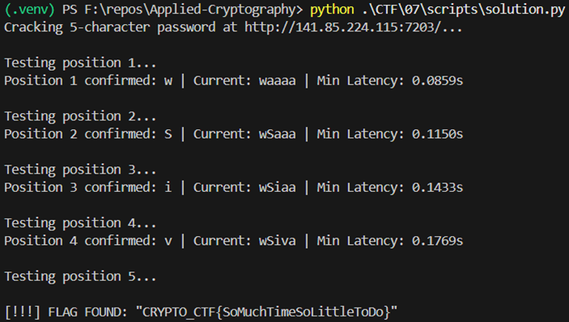

# Caesium-133 -  Writeup

Category: Web / Side-Channel Attacks Points: 100 Difficulty: Medium

1. Challenge Overview

The challenge provided a URL and a brief set of instructions:

    Target: http://141.85.224.115:7203/

    Method: POST with application/json content type.

    Clue: "Caesium-133. Password is alphanumeric. Quid pro quo."

The name Caesium-133 refers to the isotope used to define the "second" (time), and "Quid pro quo" (something for something) hinted that the server would reveal information (time) in exchange for our input.
2. Reconnaissance & Discovery

Initial probing using Invoke-RestMethod revealed that the server performed length validation before checking the password content.

    Sending a 10-character password returned: "Wrong length"

    Sending a 5-character password returned: "Wrong password"

This confirmed the password length was exactly 5 characters. The change in error message indicated that the server only proceeded to the comparison logic when the length gate was cleared.
3. Vulnerability Analysis: Timing Attack

The server was vulnerable to a Time-based Side-Channel Attack. Specifically, it used a non-constant-time comparison (likely a for loop that sleeps or returns early on the first mismatch).

If the first character was correct, the server would move to the second, adding a measurable delay (latency). By measuring these tiny differences in response time, we could "brute force" the password one character at a time rather than testing all combinations.
4. Exploitation

To overcome network jitter (random internet lag), a Python script was used to perform statistical sampling. The script:

    Sent 10-15 requests for every possible alphanumeric character.

    Recorded the Minimum Latency (to filter out random network spikes).

    Selected the character with the highest minimum latency as the winner for that position.

Execution Trace:

    Position 1: w (~86ms)

    Position 2: S (~131ms) — Jump of ~45ms

    Position 3: i (~147ms)

    Position 4: v (~179ms) — Jump of ~32ms

    Position 5: [Final Character]

As each character was correctly identified, the base latency increased by approximately 30-45ms, confirming the "staircase" effect of the timing attack.

#### FLAG: CRYPTO_CTF{SoMuchTimeSoLitteleToDo}

5. Conclusion

By systematically identifying the length and then the characters via timing differences, the 5-character password was recovered.
Key Takeaways:

    Length Check First: Always identify the expected input length to narrow the attack surface.

    Statistical Analysis: In remote timing attacks, use the min() of several samples rather than the average() to better handle network noise.

    Constant-Time Comparisons: To prevent this, developers should use functions like hmac.compare_digest() which take the same amount of time regardless of how many characters match.