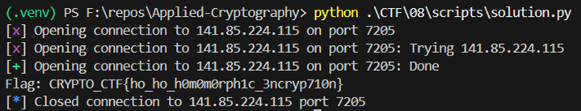

# Multi... what - Writeup
The Multi... what challenge is a cryptography task that centers on the Paillier cryptosystem. While Paillier is famously an additively homomorphic scheme, the "security" of the flag in this challenge doesn't rely on the math of the cryptosystem itself, but rather on a simple arithmetic obfuscation that can be easily reversed.

## Vulnerability Analysis

The vulnerability lies in the return_flag function within the provided source code.

1. The Obfuscation Logic

    - When you request the flag (Option 3), the server executes the following logic:

        - It encrypts the flag using Paillier: encrypted_flag = public_key.encrypt(FLAG).

        - It generates a large random integer named value.

        - It creates a "protected" ciphertext (ct) using standard Python integer arithmetic:
            ```math 
            ct=(cflag​+value)×1337
            ```

        - It sends both the final ct and the value to the user.

2. The Flaw

    - The operation above is not a homomorphic operation; it is simple integer algebra performed on the ciphertext bits after they have been encrypted. Because the server gives you both the result (ct) and the variable (value), you can use basic algebra to isolate the original ciphertext (cflag​):
    ```math
    cflag​=(ct//1337)−value
    ```
3. The Decryption Oracle

    - The decrypt function (Option 2) acts as a Decryption Oracle. It takes any integer input, treats it as a Paillier ciphertext, and returns the decrypted plaintext to the user without any restrictions. Once we have recovered cflag​, we can simply ask the server to decrypt it for us.

## Solution Steps

1. Connect to the server: Use netcat or a script to interface with the service at the provided IP and port.

2. Retrieve Flag Data: Choose option 3. Return flag to receive the obfuscated Ciphertext and the Value.

3. Recover Original Ciphertext: Perform the inverse math: divide the Ciphertext by 1337 and subtract the Value.

4. Decrypt: Choose option 2. Decrypt and provide the recovered integer.

5. Convert to Text: The server returns a large integer. Convert this integer from bytes to a string to reveal the flag.

    

### Final Flag: `CRYPTO_CTF{ho_ho_h0m0m0rph1c_3ncryp710n}`