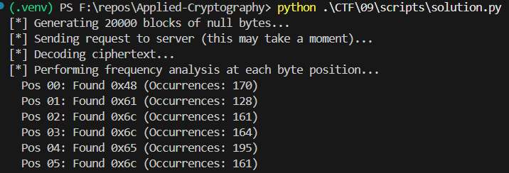
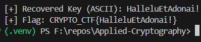

# Dutchman's Patrols - Writeup

The Dutchman's Patrols challenge is a cryptography task that requires exploiting a statistical vulnerability in a custom encryption layer built on top of AES-ECB. By analyzing the provided Python script, we can identify a "leak" that exposes the secret key through frequency analysis.

1. Vulnerability Analysis

    - The script uses a custom encrypt_decrypt function. While it utilizes AES in ECB mode, it does not encrypt the message directly with the key. Instead, it generates a pseudo-random pad for every 16-byte block and XORs that pad with the plaintext.

    - The vulnerability lies in how this pad is modified before the XOR operation:

    - The Mixer: A 4-bit mixer value is derived from a PRNG. If all 4 bits are '1' (a 1 in 16 chance), the variable int(mixer) // 1111 evaluates to 1.

    - The Key Injection: When the mixer evaluates to 1, the code calculates a hashval (an index between 0 and 15) and performs this operation: hashval = byte_xor(key[:hashval] + pad[hashval:hashval+1] + key[hashval+1:], key).

    - The Result: This specific XOR logic simplifies mathematically. Because (key ^ key) is 0, the operation effectively replaces the byte at pad[hashval] with the byte at key[hashval].

    - Conclusion: In approximately 1/256 of all blocks (1/16 chance for the mixer × 1/16 chance for the specific index), the byte at position i of the encryption pad is replaced by the secret key byte at that same position.

2. Exploitation Strategy: Chosen Plaintext Attack

    - Since the encryption is C=P⊕Pad, we can reveal the pad by sending a plaintext (P) consisting entirely of null bytes (0x00).

    ```math
    C=0x00⊕Pad⟹C=Pad.
    ```

    - By requesting the encryption of thousands of null blocks, we can collect thousands of samples of the "pad".

    - While most bytes in the pad are pseudo-random AES outputs, the secret key bytes will appear significantly more often than random noise due to the injection bug.


3. Solution Script

    - The `solution.py` script automates the process of sending a large payload of null bytes to the server and performing frequency analysis on the response to recover the 16-byte key.
        

4. Flag Recovery
    - Running the `solution.py` script reveals the most frequent byte at each of the 16 positions. Once combined, these bytes form the secret key used by the server.
    
    
### Final Flag: `CRYPTO_CTF{<recovered_key>}`