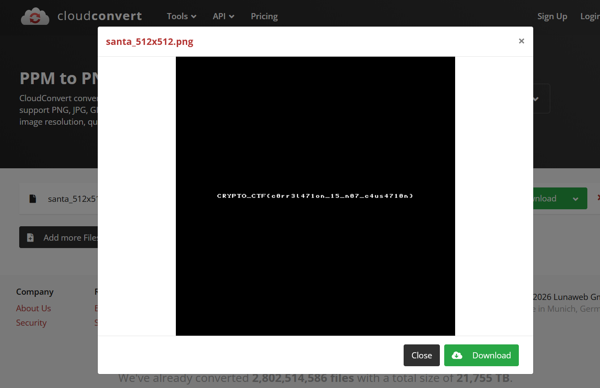

# Long Frightening Santa Ramble - Writeup

## Summary
The ELF binary is an encryptor that reads a PPM image, generates a keystream from three 8-bit LFSRs, and XORs the bytes to produce `santa_512x512.enc`. The keystream is recoverable because the PPM header is known plaintext. Brute-forcing the three 8-bit seeds yields the keystream and allows full decryption.

## Files Provided
- `lfsr_O0` (ELF binary)
- `santa_512x512.enc` (encrypted image)

## Binary Behavior (High Level)
The program:
- opens `santa_512x512.ppm` for reading
- seeds three 8-bit LFSRs from `/dev/urandom`
- generates 1 keystream byte per plaintext byte
- XORs plaintext byte with keystream byte
- writes the result to `santa_512x512.enc`

## LFSR Details
From the disassembly:
- Each LFSR is 8 bits wide
- Feedback masks are:
  - LFSR1: `0xB8`
  - LFSR2: `0xE8`
  - LFSR3: `0xD2`
- Output bit is the LSB before shifting
- Feedback is the parity of `(state & mask)`
- Combine function for the three output bits:
  - If `c == 0`: output is `a | b`
  - If `c == 1`: output is `a & b`

## Known Plaintext Attack
PPM files start with a deterministic header for this file:
```
P6
512 512
255
```

XORing the ciphertext with this header yields the first few keystream bytes. Since each LFSR has only 8 bits, the total key space is `255^3` (non-zero seeds), which is small enough to brute-force.

## Recovered Seeds
Brute-forcing against the header bits yields:
- LFSR1 seed = `0xE0` (224)
- LFSR2 seed = `0xE9` (233)
- LFSR3 seed = `0xFE` (254)

## Decryption
Once the seeds are recovered, generate the full keystream and XOR the ciphertext to recover the original PPM image. The decrypted output is `santa_512x512.ppm`, which contains the flag when opened as an image.

## Reproduction
Run the solver script in the project directory:
```
python3 solve_lfsr.py
```

This writes `santa_512x512.ppm`. Open it with any image viewer or convert it to PNG to read the flag.



## Flag

After opening the reversing the encryption of the image we opened the file and saw the following flag.

`CRYPTO_CTF{c0rr3l47on_15_n07_c4us4710n}`
